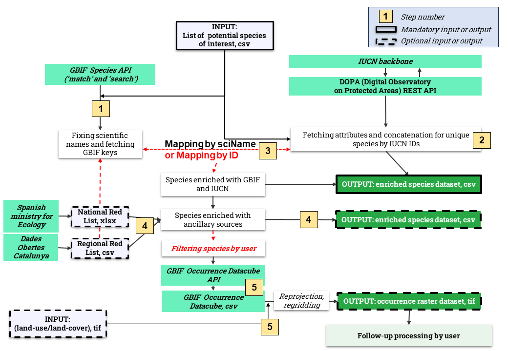

### Enrichment of species with data from IUCN, GBIF and ancillary sources

This tool is solving the task of the extraction of available data for potential sub(species) of interest from GBIF, IUCN and ancillary user-defined sources and enrichment it with spatial raster datasets.

**Registration is required to access [DOPA REST services](https://dopa-services.jrc.ec.europa.eu/services/) to get complete data.**

#### Input data

1. List of scientific names of potential target sub(species) (another option of species list accessed through command-line is yet to be implemented)
- Mandatory: yes
- Format: CSV/XLSX or command line string
2. Ancillary lists for the potential target sub(species) (for example, national or regional Red Lists)
- Mandatory: no
- Format: CSV/XLSX
3. Spatial raster dataset, describing (semi-)natural features of the area of interest (for example, land-use/land cover, water index, temperature regime etc.)
- Mandatory: no
- Format: GeoTIFF

#### Output data

1. Tabular data with all data available from GBIF, IUCN and ancillary sources
- Mandatory: yes
- Format: CSV
2. Occurrence datacube from GBIF fetched for filtered or all species, converted into raster dataset regridded by the input raster file (specified by user and might represent bioclimatic variables of the study area or land-use/land-cover for the further spatial analysis)
- Mandatory: no
- Format: GeoTIFF with at least two bands (input raster dataset and gridded snapshots of species occurrence count)

#### Workflow description

Workflow is being implemented in a few steps: 

1. [GBIF-enrichment](1_gbif_lookup.py) ***(MANDATORY)***
	- [GBIF Species API (GET /species/match)](https://techdocs.gbif.org/en/openapi/v1/species#/Searching%20names/matchNames) to fix the custom list of scientific names of species
	- [GBIF Species API (GET /species/search)](https://techdocs.gbif.org/en/openapi/v1/species#/Searching%20names/searchNames) to fetch GBIF unique keys (IDs).

2. [IUCN-enrichment](2_dopa_get_species.py) ***(MANDATORY)*** through [DOPA (Digital Observatory on Protected Areas) REST API services](https://dopa-services.jrc.ec.europa.eu/services/) as IUCN APIs are currently unavailable to sign up.
	- Fetching multiple attributes of species (habitats, threats, stresses, countries, protection categories etc.)
	- Concatenation for unique values by IUCN IDs.

3. Mapping between GBIF-enriched and IUCN-enriched datasets by the additional mapping between GBIF and IUCN keys ***(MANDATORY)***. Currently completed [mapping by scientific names from GBIF and IUCN](3_gbif_iucn_scientificName_Mapper.py). 
It can be also accessed through GUI on [Checklistbank portal](https://www.checklistbank.org/tools/name-match-async), but automatic access to this tool is not straightforward and reliable. Complete mapping between unique IDs can be accessed as a static [TSV file](https://download.checklistbank.org/job/f8/f8794f58-1a9c-4db2-b7ff-36a2559e75e9.zip), but it is not a robust solution as well.

More flexible solution with mapping by IDs should be developed to avoid keeping the mapping database in memory.

4. Species enriched with GBIF and IUCN data can be also enriched with [ancillary data from other sources](4_ancillary_ss.py) ***(OPTIONAL)***. In our case, to detect target species to calculate habitat connectivity in Catalonia, Spain, two ancillary Red Lists have been used
	- Enrichment with [the Red List of Spain](https://www.miteco.gob.es/es/biodiversidad/temas/conservacion-de-especies/especies-proteccion-especial/ce-proteccion-listado-situacion.html). This Red List has unique IDs of species but they do not match any known IDs in vocabularies from [GBIF Backbone Taxonomy](https://www.gbif.org/dataset/d7dddbf4-2cf0-4f39-9b2a-bb099caae36c). It fetches any mentions of species in the lists of rare, endangered and protected species (Listado de Especies Silvestres en Régimen de Protección Especial (LESRPE) or
Categorías en el Catálogo Español de Especies Amenazadas (CEEA)).
	- Enrichment with [the Red List of Catalonia](https://dev.socrata.com/foundry/analisi.transparenciacatalunya.cat/i8eg-aynu) accessed through Socrata API which must be run with the valid user-authenticated app token. This Red List does not have any unique IDs and consists of five columns, including the scientific name.

5. [Enrichment with GBIF datacubes](5_1_curl_datacube_request_placeholders.sh) ***(OPTIONAL)***. Considering all the data fetched from previous steps, using their knowledge and experience, users should be able to filter out species which are not suitable for their analysis for some reason (for example, users would like to compute habitat connectivity for the patches of decidious forests, while some species do not inhabit them).

	- Filtered list of species can be used then to access [GBIF occurrence datacubes](https://techdocs.gbif.org/en/data-use/data-cubes) through the user-authorised download request.
	- Downloaded csv file is [reprojected, regridded by the input raster dataset and written to the output occurrence raster file](5_2_gridding) (count of occurrence records is written to the new GeoTIFF).

This optional output can be used to conduct comparative analysis between the occurrence of the target species and bio-climatic variables, land-cover types, types of habitats, verify species distribution models etc.

#### Current state

This tool is partly completed, but a few improvements are planned to be done:

- ~~**Currently, the third step is missing (mapping GBIF tabular data and IUCN tabular data by unique IDs). It is yet to be explored through [Checklistbank tools](https://www.checklistbank.org/tools/name-match-async) or by scientific or canonical names.**~~ Decided to drop the automatic access to Checklistbank tools.
- ~~**Designing an interface to filter species in the tabular output by user depending on their knowledge and experience to access GBIF datacubes later for filtered species only.**~~ Decided to use the comprehensive Jupyter Notebook.
- Fixing scientific names from ancillary sources with the same [GBIF tool](https://techdocs.gbif.org/en/openapi/v1/species#/Searching%20names/matchNames).
- Fetching data on habitat suitability and importance from IUCN.
- Cleaning up the code, aligning variables with the configuration file is required (partly completed).
- Test fetching other scopes of IUCN assessment, apart from the Global one, to bring regional protection categories, which are recorded by another ID (for example, Europe and Mediterranean ones for *Lynx lynx* can be accessed through [1](https://www.iucnredlist.org/species/12519/177350310) and [2](https://www.iucnredlist.org/species/12519/3350985) URLS with the same species ID, but different scope ID).
- In process: to test another access option of regional dataset from [Open data initiative of the Government of Spain API](https://datos.gob.es/en/apidata) (portal down on 28/08/2024). It might worth switching to this API instead of Socrata API if it doesn't require user authentication.
- Testing [IUCN API v4](https://apiv3.iucnredlist.org/) once it is published and available for sign-up.

#### Limitations
- [Checklistbank tools](https://www.checklistbank.org/tools/name-match-async) do not seem stable enough to support automatic on-fly scraping of matches between GBIF and IUCN keys. Therefore, the static database derived from this tool with mapped IUCN and GBID keys (unique IDs) for threatened species is stored separately for this workflow. 
- DOPA REST services are not supporting species whose distribution data is not mapped on IUCN (for example, [*Emys orbicularis*](https://www.iucnredlist.org/species/7717/97292665)).
- IUCN services do not support fetching data for particular sub-species, therefore only fetching data at species level is available.