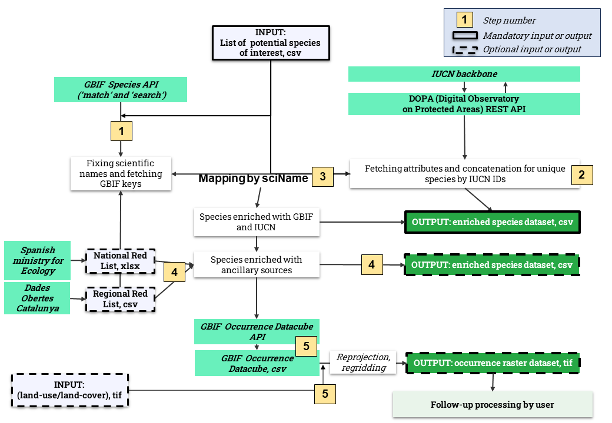

# Enrichment of species with data from IUCN, GBIF and ancillary sources

This tool is solving the task of the extraction of available data for potential sub(species) of interest from GBIF, IUCN and ancillary user-defined sources and enrichment it with spatial raster datasets.

**Registration is required to access [DOPA REST services](https://dopa-services.jrc.ec.europa.eu/services/) to get complete data.**

### Input data

1. List of scientific names of potential target sub(species) (another option of species list accessed through command-line is yet to be implemented)
- Mandatory: yes
- Format: CSV/XLSX or command line string
2. Ancillary lists for the potential target sub(species) (for example, national or regional Red Lists)
- Mandatory: no
- Format: CSV/XLSX
3. Spatial raster dataset, describing (semi-)natural features of the area of interest (for example, land-use/land cover, water index, temperature regime etc.)
- Mandatory: no
- Format: GeoTIFF

### Output data

1. Tabular data with all data available from GBIF, IUCN and ancillary sources
- Mandatory: yes
- Format: CSV
2. Occurrence datacube from GBIF fetched for filtered or all species, converted into raster dataset regridded by the input raster file (specified by user and might represent bioclimatic variables of the study area or land-use/land-cover for the further spatial analysis)
- Mandatory: no
- Format: GeoTIFF with at least two bands (input raster dataset and gridded snapshots of species occurrence count)

<hr style="border:0.5px solid #000">

## **Workflow description**

The workflow is being implemented in a few steps. See the detailed description under the diagram.

For Python scripts, the main parameters of input and output datasets are listed in the [configuration file](config/config.yaml).



### **1. [GBIF-enrichment](gbif_lookup.py)**

***MANDATORY***

This block will update the list of species with the valid GBIF keys of species:
	- [GBIF Species API (GET /species/match)](https://techdocs.gbif.org/en/openapi/v1/species#/Searching%20names/matchNames) to fix the custom list of scientific names of species
	- [GBIF Species API (GET /species/search)](https://techdocs.gbif.org/en/openapi/v1/species#/Searching%20names/searchNames) to fetch GBIF unique keys (IDs)

**USAGE**

```python3 gbif_lookup.py```

### **2. [IUCN-enrichment](dopa_get_species.py)** 

***MANDATORY***

This block can be run through [DOPA (Digital Observatory on Protected Areas) REST API services](https://dopa-services.jrc.ec.europa.eu/services/) as IUCN API v4 is currently (14/08/2025) under development.
	- Fetching multiple attributes of species (habitats, threats, stresses, countries, protection categories etc.)
	- Concatenation for unique values by IUCN IDs.

**USAGE**

```python3 dopa_get_species.py```

### **3. Mapping between GBIF-enriched and IUCN-enriched datasets by the additional mapping between GBIF and IUCN keys.**

***MANDATORY***

Currently completed [mapping by scientific names from GBIF and IUCN](gbif_iucn_scientificName_Mapper.py). 
It can be also accessed through GUI on [Checklistbank portal](https://www.checklistbank.org/tools/name-match-async), but automatic access to this tool is not straightforward and reliable. Complete mapping between unique IDs can be accessed as a static [TSV file](https://download.checklistbank.org/job/f8/f8794f58-1a9c-4db2-b7ff-36a2559e75e9.zip), but it is not a robust solution as well.

More flexible solution with mapping by IDs should be developed to avoid keeping the mapping database in memory.

**USAGE**

```python3 gbif_iucn_scientificName_Mapper.py```

### 4. Enrichment with additional custom data

***OPTIONAL***

Species enriched with GBIF and IUCN data can be also enriched with [ancillary data from other sources](ancillary_ss.py). In our case, to detect target species to calculate habitat connectivity in Catalonia, Spain, two ancillary Red Lists have been used:

- [The Red List of Spain](https://www.miteco.gob.es/es/biodiversidad/temas/conservacion-de-especies/especies-proteccion-especial/ce-proteccion-listado-situacion.html) which has unique species IDs but they do not match any known IDs in vocabularies from [GBIF Backbone Taxonomy](https://www.gbif.org/dataset/d7dddbf4-2cf0-4f39-9b2a-bb099caae36c). It extracts any mentions of species in the lists of rare, endangered and protected species (Listado de Especies Silvestres en Régimen de Protección Especial (LESRPE) or Categorías en el Catálogo Español de Especies Amenazadas (CEEA)). 

*Located [here](input/national_redlist.xlsx).*

- [The Red List of Catalonia](https://dev.socrata.com/foundry/analisi.transparenciacatalunya.cat/i8eg-aynu) accessed through Socrata API which must be run with the valid user-authenticated app token. This Red List does not have any unique IDs and consists of five columns, including the scientific name. 

*Located [here](input/regional_redlist_api.csv).*

**USAGE**

**Basic command structure:**

```bash python3 ancillary_ss.py [INPUT_CONFIG] [OUTPUT_PATH] [RED_LIST_OPTIONS] [LOGGING]```

**Detailed example**:

```bash
python3 ancillary_ss.py \
**path**=input/species_list.csv \
**name**="scientificName" \
**output**/ancillary_enriched_datacube.csv \
**-regional_redlist** \
    **path**=input/red_lists/regional_redlist_api.csv \
    **columns**=esp_cies_nom_cient_fic \
    **name**=esp_cies_nom_cient_fic \
    **protection_category**=categoria_cat_leg \
**-national_redlist** \
    **path**=input/red_lists/national_redlist.xlsx \
    **columns**="Nombre científico actualizado" \
    **name**="Nombre científico actualizado" \
    **protection_category**="Listado de Especies Silvestres en Régimen de Protección Especial (LESRPE)/Categorías en el Catálogo Español de Especies Amenazadas (CEEA)" \
**-log_level** DEBUG
```

#### Parameter breakdown

| Argument | Sub-argument | Value | Description               |
|-----------|---------------|-------|---------------------------|
| **`input_species_list`** | - | - |**Primary&nbsp;species&nbsp;dataset&nbsp;configuration**|
|  | `path` | `input/species_list.csv` |Input&nbsp;CSV&nbsp;file&nbsp;with&nbsp;species&nbsp;list|
|  | `name` | `"scientificName"` |Column&nbsp;containing&nbsp;scientific&nbsp;names|
| **`output`** | - | `output/ancillary_enriched_datacube.csv` |**Enriched&nbsp;output&nbsp;file**|
| **`national_redlist`** | - | - |**National conservation data configuration**|
|  | `path` | `input/red_lists/national_redlist.xlsx` |Path to national conservation Red List|
|  | `columns` | `"Nombre científico actualizado"` |Columns to join from the redlist|
|  | `name` | `"Nombre científico actualizado"` |Column with the scientific name of species|
|  | `protection_category` | `"LESRPE/CEEA Categories"` |Column name with protection category|
| **`regional_redlist`** | - | - |**Regional&nbsp;conservation&nbsp;data&nbsp;configuration**|
|  | `path` | `input/red_lists/regional_redlist_api.csv` |Path to regional conservation Red List|
|  | `columns` | `esp_cies_nom_cient_fic` |Columns to join from the redlist|
|  | `name` | `esp_cies_nom_cient_fic` |Column with the scientific name of species|
|  | `protection_category` | `categoria_cat_leg` |Column name with protection category|
| **`logging`** | `-log_level` | `DEBUG` |Enable detailed logging|


5. **Enrichment with GBIF datacubes**

***(OPTIONAL)***

Considering all the data fetched from previous steps, using their knowledge and experience, user should be able to filter out species which are not suitable for their analysis for some reason (for example, user would like to compute habitat connectivity for the shrubland forests, while some species do not prefer them).

- Filtered list of species can be used to access [GBIF occurrence datacubes](https://techdocs.gbif.org/en/data-use/data-cubes) through the user-authorised download request, running the [Shell script](curl_datacube_request_placeholders.sh). **NOTE**: depending on the filters applied, requests to the GBIF database may take a long time, in some cases many minutes, to complete.
- Downloaded csv file is [reprojected, regridded by the input raster dataset and written to the output occurrence raster file](gridding.py) (count of occurrence records is written to the new GeoTIFF).

This optional output can be used to conduct comparative analysis between the occurrence of the target species and bio-climatic variables, land-cover types, types of habitats, verify species distribution models etc.

**USAGE**

`./curl_datacube_request_placeholders.sh`

`python3 gridding.py`

<hr style="border:0.5px solid #000">

#### Limitations
- [Checklistbank tools](https://www.checklistbank.org/tools/name-match-async) do not seem stable enough to support automatic on-fly scraping of matches between GBIF and IUCN keys. Therefore, the static database derived from this tool with mapped IUCN and GBID keys (unique IDs) for threatened species is stored separately for this workflow. 
- DOPA REST services are not supporting species whose distribution data is not mapped on IUCN (for example, [*Emys orbicularis*](https://www.iucnredlist.org/species/7717/97292665)).
- IUCN services do not support fetching data for particular sub-species, therefore only fetching data at species level is available.
- [IUCN API v4](https://api.iucnredlist.org/) has been launched and is available for non-commercial usage: [sign up](https://api.iucnredlist.org/users/sign_up) or [sign in](https://api.iucnredlist.org/users/sign_in).  
However, it is not fully documented (as of 13/08/2025) and cannot be implemented in the current version of this tool.
- GBIF backbone taxonomy does not define Reptilia as a separate class (class with id=358 dedicated to Reptilia database). For the purposes of the case study, two Reptilia classes (Testudines, taxon key 11418114) and (Squamata, taxon key, 11592253) have been used.
- For largest datasets (`Aves` class) the following issue faced (17739293 records): 
"numpy.core._exceptions._ArrayMemoryError: Unable to allocate 812. MiB for an array with shape (6, 17739293) and data type object".
It is solved by chunking and filtering out records outside of the bounding box.

#### Acknowledgements

The work has been co-funded by the European Union and the United Kingdom under the Horizon Europe [AD4GD Project](https://www.ogc.org/initiatives/ad4gd/).
